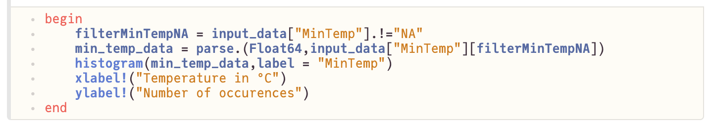
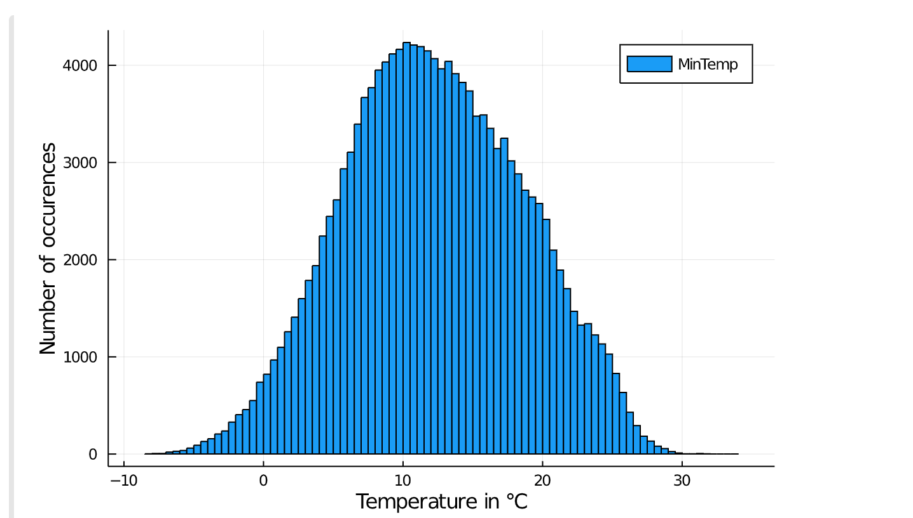
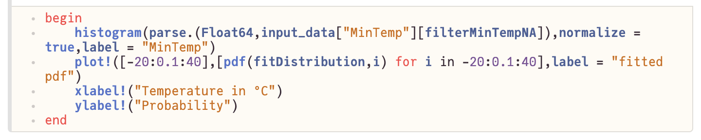
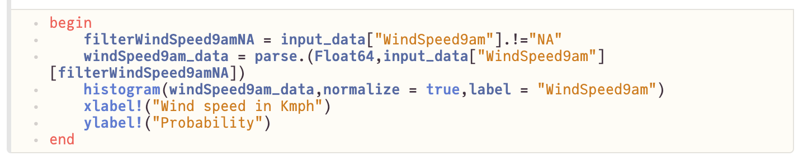
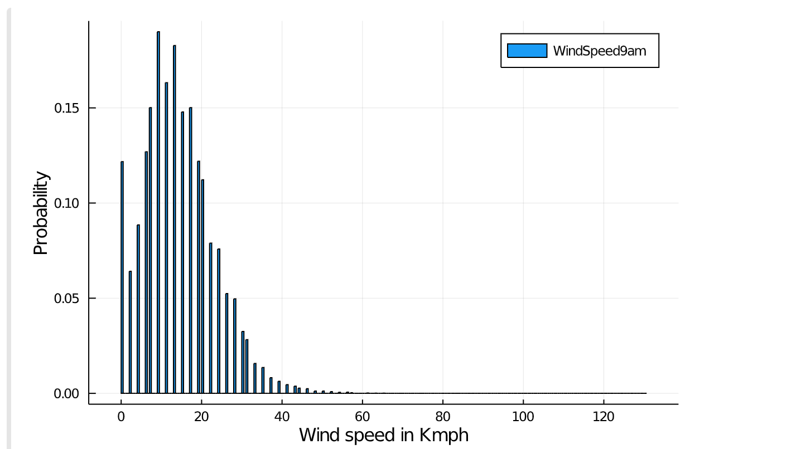
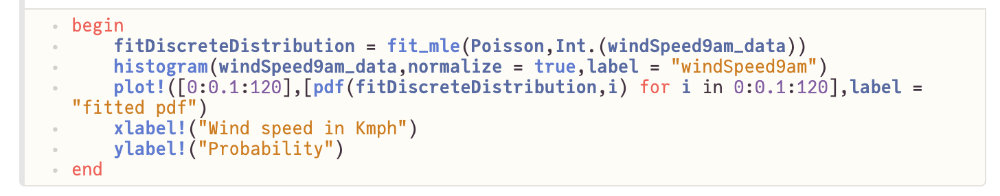
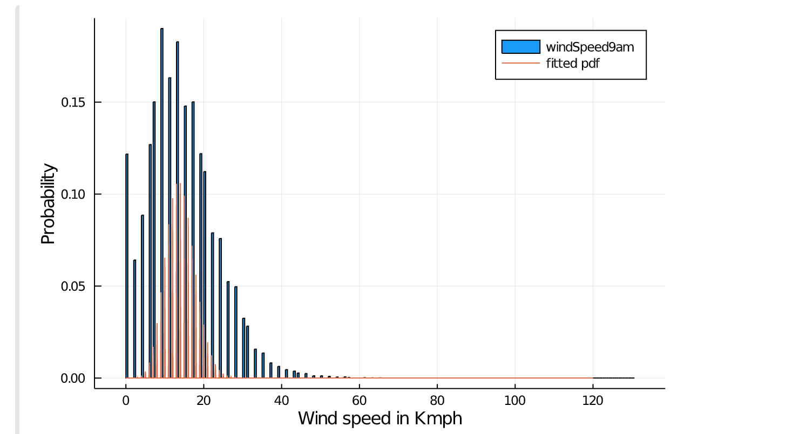
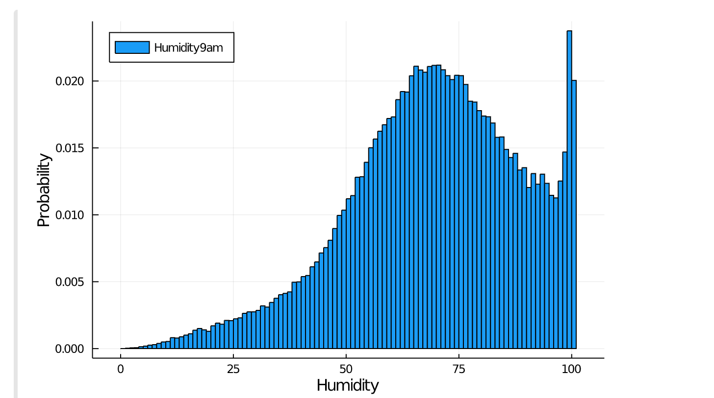
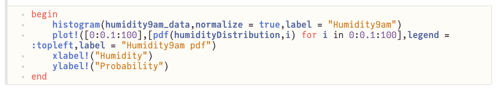

# Distributions in Julia
## *A short introduction to the Distributions package in the Julia programming language*

In this post we will provide some examples of probability distributions using the [Distributions](https://github.com/JuliaStats/Distributions.jl) package in Julia interactively with the [Pluto](https://github.com/fonsp/Pluto.jl) package. The Distributions package allows the generation, sampling and working with both discrete and continuous probability distributions in Julia, as well as fitting them to a dataset using maximum likelihood estimation. Pluto helps in building interactive notebooks and enables creating our own widgets by HTML, Javascript and CSS.

Using a [dataset](https://www.kaggle.com/jsphyg/weather-dataset-rattle-package) for rainfall in Australia, we will show examples of continuous and discrete distribution fitting and also how a mixture model can be fitted when we have complex data with multiple peaks and a known limit.

The dataset’s purpose is to predict the next day's rainfall amount which will not be our goal here, instead we are going to focus on finding the correct distribution and hyperparameters for the different features in the dataset. 

Let’s first set up our environment then load in the data and check the features:

Reading the data and displaying the first 10 rows:

Let’s start modelling the MinTemp variable. First, we will get the histogram of this feature by using the histogram function in Plots. Note that we have to pre process this dataset since all the values are strings. They also contain NA values which have to be filtered out before any plotting or processing. We create a filter to remove the NA values then convert to Floats with the parse method.

This feature looks like a [Gaussian](https://en.wikipedia.org/wiki/Normal_distribution) distribution, so let’s fit that distribution to it using a maximum likelihood estimate as follows:
1. Generate a distribution whose parameters have been fit to the data
2. Plot a histogram of the actual data
3. Create a list comprehension of the pdf of the distribution we generated
4. Plot the generated pdf values
 

This variable seems to be modelled well by a gaussian. Notice that there is a difference in the y-axis values between the current plot and the previous one, as we have normalized the histogram values to make sure they sum up to 1, so that we can visually compare them with pdf values.

Applying the same steps for another feature, for example WindSpeed9am, we can see from the histogram that this distribution is more discretized, and has inconsistent sampling intervals.

Let’s see what it looks like when we try to fit a discrete distribution such as the Poisson.

The fitted Poisson doesn't match the data, this is because of the irregular sampling intervals. Instead of trying to fit a parametric distribution to it, we can choose to fit a non parametric model that captures the same probabilities as the individual components of the target data as follows:

What happens here, is we first get the unique values of the distribution, then get an array of probabilities for each value, given the data we have. We then construct our distribution with the DiscreteNonParametric function (which needs a vector of the values we have and a vector of the respective probabilities). 

Since we now have a distribution of the data, we can use the other functions provided by the Distributions package to get any information we may need, for example, we can use the cdf function to get cumulative probabilities:

Finally, let’s see what the Humidity9am feature looks like:

It seems to be more complicated with two distinct peaks. It also has a visible upper limit. We can create a [mixture model](https://en.wikipedia.org/wiki/Mixture_model) made of two distributions to try to capture the peaks, and to deal with the upper limit, we will truncate the component Gaussians with an upper limit of 100 and an unbounded lower limit. The Distributions package makes this easy, as shown below:

The μ and σ parameters control the distributions themselves, but what is the prior variable?
It controls our prior belief of which distribution is going to be sampled more than the other. The prior probabilities have to sum to one to make this a valid mixture model.

Playing around with these parameters to try to fit the data can result in a setting of parameters similar to this:
μ1 = 70, σ1 = 20, μ2 = 100, σ2 = 1.5, prior = 0.97

Plotting the pdf of the distribution using the above parameters:

Modifying the parameters is easier and more interactive with Pluto, so it made experimenting with different distributions in this notebook a lot more enjoyable. It isn’t necessary to run any of the code shown here though, so all that’s actually needed for this demonstration is the Distributions package, and the CSV and Plots packages for reading and visualizing the data respectively.

This is an example of the code snippet used to generate sliders that control the 5 parameters used in the last example:

This is just a quick and simple introduction to what can be done with the Distributions package. For other features and different distributions you can check the package documentation [here](https://juliastats.org/Distributions.jl/stable/). You can also find the full notebook [here](https://github.com/Optomatica/opto_ml_blog/blob/17f8a3fec9c201f885eee5aa6e4e4fbf1016b7d0/Distributions_in_Julia_files/Distributions_in_Julia.jl).

