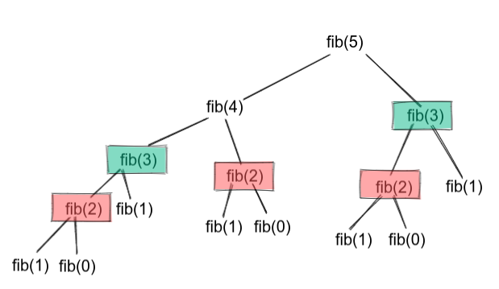

# Julia Iterate, Recursion and Closure.
## Fibonacci Example

Fibonacci sequence is a sequence of numbers such as each number is a result of summing up the previous two numbers.

> 1, 1, 2, 3, 5, 8, 13, 21, ..., etc

## 1. Simple Loop
The natural way of approaching this problem is to start with `a=0`, `b=1` and keep adding those variables along the way to the target sequence.

```julia
function fib_loop(n)
    a, b = 0, 1
    for i=2:n
        a, b = b, a+b
    end
    return b
end    
```

## 2. Julia Iterators
One of Julia powerful features is the using of multiple-dispatch. This allows any function to have multiple implementations based on the type of passed arguments. So in our case we'll have a [`struct`](https://docs.julialang.org/en/v1/manual/types/#Composite-Types) that holds the info of the current iteration. Struct is simply an object in any other programming language.

```julia
struct FibStruct
    n::Int 
end
```

Now we'll define [iterate](https://docs.julialang.org/en/v1/manual/interfaces/#man-interface-iteration) function that works exclusively for `FibStruct`

```julia
"""
For next iterations, the result will be based on the coming a, b
"""
function Base.iterate(f::FibStruct, state=(n=1, a=0, b=1))
    if state.n > f.n
        return nothing
    else
        a, b = state.b, state.a+state.b
        n = state.n + 1
        return b, (n=n, a=a, b=b)
    end
end
```


## 3. Recursion
The Fibonacci sequence has always been the manifesto example for recursion. You start in a top-down approach from given N until reaching the base case `0`.

```julia
function fib_recursion(n)
    if n == 0 || n == 1
        return n
    else
        return fib_recursion(n-1) + fib_recursion(n-2)
    end
end
```

However this approach is very slow. We may not even be able to compute higher numbers before the end of the day or crashing the memory. 

The problem is that when we are trying to calculate the fifth fibonacci element we'll calculate the fibonacci of `2` twice. Every time you calculate higher number repeated calculations increase. To solve that we can save the values of our calculations so that we won't need to recalculate them. 



## 4. Optimized Recursion
Now every time we calculate the fibonacci of a number, we'll save the value of that number in a dictionary or array. That way we won't recalculate values as it's already saved in the dictionary.

```julia
function fib_recursion_improved(n, history=Dict(0=>0, 1=>1))
    if haskey(history, n)
        return history[n]
    else
        history[n] = fib_recursion_improved(n-1, history) + fib_recursion_improved(n-2, history)
    end
end
```


## 5. Julia Closures
[Closures](https://docs.julialang.org/en/v1/devdocs/functions/#Closures) is a way of storing functions binded with variables. Now we'll use closures to build a function `get_next_number` that keeps generating fibonacci sequence

```julia
function fib_closure()
    a = 0
    b = 1
    function get_next_number()
        a, b = b, a+b
        return b
    end
    return get_next_number
end

```
Since we need to save the values of `a` & `b` along the way, we'll be declaring them in the outer function `fib_closure` 

Now when you can call it like that

```julia
generate = fib_closure()

generate() #1
generate() #1
generate() #2
generate() #3
.
.
.
generate() #21
```

Since we need to calculate nth fibonacci, we'll need to loop n times until reaching the nth fibonacci number.

```julia
function fib_closure(n)
    a = 0
    b = 1
    function get_next_number()
        a, b = b, a+b
        return b
    end
    return (get_next_number() for i=2:n)
end
```

## Conclusion
In this tutorial we've explained ways to measure fibonacci. Some ways are identical to other programming language and other ways are exclusively in Julia. 
Also we've measured the time of each function using [`BenchmarkTool.jl`](https://github.com/JuliaCI/BenchmarkTools.jl) while calculating the 90s fibonacci number. 
Note: If you try higher number than 93, you'll have an overflow. You may want to use other datatypes like [UInt64, Int128, UInt128](https://docs.julialang.org/en/v1/manual/integers-and-floating-point-numbers/) or [BigInt](https://docs.julialang.org/en/v1/base/numbers/#Base.GMP.BigInt) 

- fib_loop(90) 
    ```julia
    @btime begin
        fib_loop(90)
    end
    # 2.029 ns (0 allocations: 0 bytes)
    ```
- FibStruct(90)
    ```julia
    @btime begin 
        for i in FibStruct(90)
        end        
    end
    # 1.812 ns (0 allocations: 0 bytes)
    ```
- fib_recursion(90)
    ```julia
    @btime begin
        fib_recursion(90)
    end
    # More than 20 mins
    ```
- fib_recursion_improved(90)
    ```julia
    @btime begin
        fib_recursion_improved(90)
    end
    # 3.481 μs (10 allocations: 6.58 KiB)
    ```
- fib_closure(90)
    ```julia
    @btime begin
        collect(fib_closure(90))[end]    
    end
    # 2.372 μs (82 allocations: 2.11 KiB)
    ```