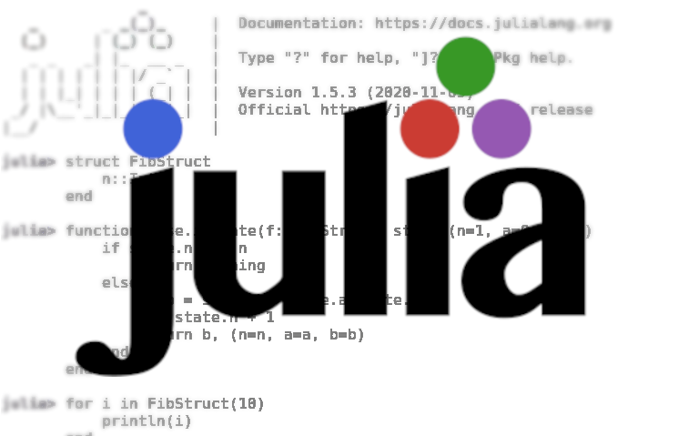
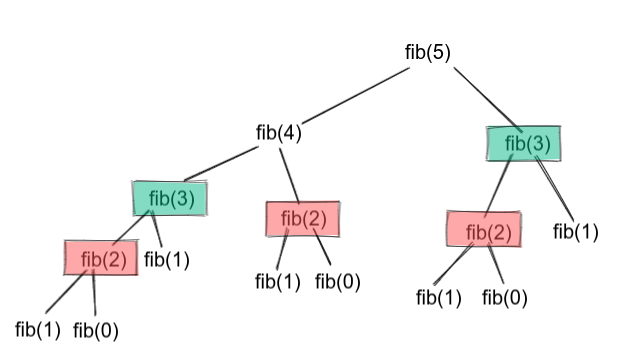

# Julia Iterate, Recursion and Closure.


In this post, we'll go through different Julia capabilities like Iterate ,recursion and closures. We will show code snippets of how to use these features in Julia using a simple example of fibonacci sequence. We'll start with a simple `for loop` and then see how we can use julia multiple dispatch with [`Base.iterate`](https://docs.julialang.org/en/v1/manual/interfaces/#man-interface-iteration) . Also we'll show the simple recursive method and an optimized version of recursion. Finally we'll talk about [`closures`](https://docs.julialang.org/en/v1/devdocs/functions/#Closures). Full code can be found on [`Github`](https://github.com/ms10596/opto_ml_blog/blob/master/julia_closure/main.jl).

Fibonacci sequence is a sequence of numbers such as each number is a result of summing up the previous two numbers.

> 1, 1, 2, 3, 5, 8, 13, 21, ..., etc

# Loops with Julia

## 1. Simple Loop
The natural way of approaching Fibonacci sequence is to start with `a=0`, `b=1` and keep adding those variables along the way to the target sequence.

```julia
function fib_loop(n)
    a, b = 0, 1
    for i=2:n
        a, b = b, a+b
    end
    return b
end    
```

## 2. Julia Iterators
One of Julia powerful features is the using of multiple-dispatch. This allows any function to have multiple implementations based on the type of passed arguments. So in our case we'll need have a [`struct`](https://docs.julialang.org/en/v1/manual/types/#Composite-Types) that holds the info of the current iteration and to pass it to `Base.iterate` to generate a new fibonacci sequence at each iteration. 
In our case the struct will be holding an integer that refers to the current fibonacci index (in other cases, you can make your own complex structs with many fields and `new` function as constructor).
```julia
struct FibStruct
    n::Int 
end
```

Now we'll define iterate function that works exclusively for `FibStruct`

```julia
"""
For next iterations, the result will be based on the coming a, b
"""
function Base.iterate(f::FibStruct, state=(n=1, a=0, b=1))
    if state.n > f.n
        return nothing
    else
        a, b = state.b, state.a+state.b
        n = state.n + 1
        return b, (n=n, a=a, b=b)
    end
end
```


# Recursion with Julia
## 3. Simple Recursion
By applying the top-down approach from given N until reaching the base case `0`, we can do the following with Julia but this approach is very slow. We may not even be able to compute higher numbers before the end of the day or crashing the memory. 

```julia
function fib_recursion(n)
    if n == 0 || n == 1
        return n
    else
        return fib_recursion(n-1) + fib_recursion(n-2)
    end
end
```


The problem is that when we are trying to calculate the fifth fibonacci element we'll calculate the fibonacci of `2` twice. Every time you calculate higher number repeated calculations increase. To solve that we can save the values of our calculations so that we won't need to recalculate them. 



## 4. Optimized Recursion
Now every time we calculate the fibonacci of a number, we'll save the value of that number in a dictionary or array. In this way we won't recalculate values as it's already saved in the dictionary and we will have also to pass this dictionary at each time as a parameter.

```julia
function fib_recursion_improved(n, history=Dict(0=>0, 1=>1))
    if haskey(history, n)
        return history[n]
    else
        history[n] = fib_recursion_improved(n-1, history) + fib_recursion_improved(n-2, history)
    end
end
```


# Closures with Julia
## 5. Julia Closures
Closure is a combination of  functions binded with its surrounding state such as other outer variables or functions. It provides you with an easier and cleaner way to make stateful function without needing to create a struct or class. 

Now we'll use closures to build a function `get_next_number` that keeps generating fibonacci sequence.
Since we need to save the values of `a` & `b` along the way, we'll be declaring them in the outer function `fib_closure` , Then to calculate nth fibonacci, we'll need to loop n times until reaching the nth fibonacci number.

```julia
function fib_closure(n)
    a = 0
    b = 1
    function get_next_number()
        a, b = b, a+b
        return b
    end
    return (get_next_number() for i=2:n)
end
```

# Conclusions
In this post, we've explained Julia's iterate ,recurusion and closures via a fibonacci series example. As a comparison, we can measure the time of each function and the allocated memory using [`BenchmarkTool.jl`](https://github.com/JuliaCI/BenchmarkTools.jl) while calculating the 90s fibonacci number. 
Note: If you try higher number than 93, you'll have an overflow. You may want to use other datatypes like [UInt64, Int128, UInt128](https://docs.julialang.org/en/v1/manual/integers-and-floating-point-numbers/) or [BigInt](https://docs.julialang.org/en/v1/base/numbers/#Base.GMP.BigInt) .

Using loops has less computation time and no memory was allocated. On the other side, closure is better than the recursion with respect to both of the computation time and the allocated memory


- Using loops
    ```julia
    @btime begin 
        fib_loop(90) 
    end
    # 2.029 ns (0 allocations: 0 bytes)
    ```

    ```julia
    @btime begin 
        fib_struct = FibStruct(90)
        next = iterate(fib_struct)
        while next !== nothing
            (i, state) = next
            next = iterate(fib_struct, state)
        end
        # The above code is the same like this
        # for i in FibStruct(90)
        # end        
    end
    # 1.812 ns (0 allocations: 0 bytes)
    ```
- Using recursion
    ```julia
    @btime begin
        fib_recursion(90)
    end
    # More than 20 mins
    ```

    ```julia
    @btime begin
        fib_recursion_improved(90)
    end
    # 3.481 μs (10 allocations: 6.58 KiB)
    ```
- Using closures
    ```julia
    @btime begin
        collect(fib_closure(90))[end]    
    end
    # 2.372 μs (82 allocations: 2.11 KiB)
    ```

